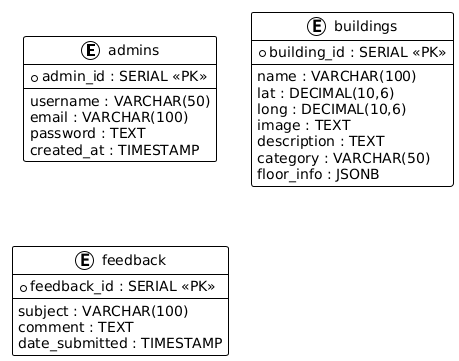

# Campus Tour Assistant — Backend & Database

---

## Table of Contents

1. [Project Overview](#project-overview)
2. [Database Design](#database-design)
   - [Tables](#tables)
   - [ERD Diagram](#erd-diagram)
3. [Backend Folder Structure](#backend-folder-structure)
4. [Database Connection](#database-connection)
5. [Models](#models)
   - [Admin Model](#admin-model)
   - [Buildings Model](#buildings-model)
   - [Feedback Model](#feedback-model)
6. [Authentication System](#authentication-system)
7. [API Routes](#api-routes)
8. [Setup Instructions](#setup-instructions)
9. [Environment Variables](#environment-variables)

---

## Project Overview

This backend is built with **Node.js** and **PostgreSQL (Supabase)** to provide database management, admin authentication, and CRUD operations for a Campus Tour Assistant web application.

- **Database:** PostgreSQL hosted on Supabase
- **Backend:** Node.js
- **Authentication:** JWT + bcrypt

---

## Database Design

### Tables

**1. admins**
| Field | Type | Constraints |
|------------|------------|-----------------|
| admin_id | SERIAL | PRIMARY KEY |
| username | VARCHAR(50)| UNIQUE, NOT NULL|
| email | VARCHAR(100)| UNIQUE, NOT NULL|
| password | TEXT | NOT NULL |
| created_at | TIMESTAMP | DEFAULT NOW() |

**2. buildings**
| Field | Type | Constraints |
|-------------|------------|-----------------|
| id | SERIAL | PRIMARY KEY |
| name | VARCHAR(100)| UNIQUE, NOT NULL|
| lat | DECIMAL(10,6)| NOT NULL |
| long | DECIMAL(10,6)| NOT NULL |
| image | TEXT | NULL |
| description | TEXT | NULL |
| category | VARCHAR(50)| NULL |
| floor_info | JSONB | NULL |

**3. feedback**
| Field | Type | Constraints |
|---------------|-----------|-----------------|
| feedback_id | SERIAL | PRIMARY KEY |
| subject | VARCHAR(100)| NOT NULL |
| comment | TEXT | NOT NULL |
| date_submitted | TIMESTAMP| DEFAULT NOW() |

---

### ERD Diagram

## Models

### Admin Model (`models/Admin.js`)

**Functions:**

- `createAdmin(data)` — Add a new admin
- `getAdminByUsername(username)` — Fetch admin by username
- `verifyPassword(plainPassword, hashedPassword)` — Check password

---

### Buildings Model (`models/Building.js`)

**Functions:**

- `addBuilding(data)` — Add a new building
- `getAllBuildings()` — Retrieve all buildings
- `getBuildingByName(name)` — Retrieve a building by name
- `updateBuilding(id, data)` — Update a building by ID
- `deleteBuilding(id)` — Delete a building by ID

---

### Feedback Model (`models/Feedback.js`)

**Functions:**

- `addFeedback(data)` — Add new feedback
- `getAllFeedback()` — Retrieve all feedback
- `getFeedbackById(id)` — Retrieve feedback by ID
- `deleteFeedback(id)` — Delete feedback by ID

## Authentication System

- **Password Hashing:**  
  Admin passwords are hashed using **bcrypt** before storing in the database. This ensures that plain passwords are never saved.

- **JWT (JSON Web Token):**  
  On successful login, the backend generates a **JWT token**.  
  This token is signed with a **secret key** stored in your `.env` file (`JWT_SECRET`).  
  The token is then sent to the client to authorize future requests.

- **Auth Middleware:**  
  Routes that require admin access are protected using **JWT verification**.  
  The middleware checks the `Authorization: Bearer <token>` header and validates the token.  
  If valid, it attaches the admin data to `req.admin` for further use.

- **Secure Admin Routes:**  
  Only authenticated admins with a valid JWT can **create, update, or delete** data in the database.  
  This protects sensitive endpoints from unauthorized access.

### Environment Variables (.env)

- SUPABASE_URL=https://<project-id>.supabase.co
- SUPABASE_KEY= <your-service-key>
- JWT_SECRET = your_secret_key
